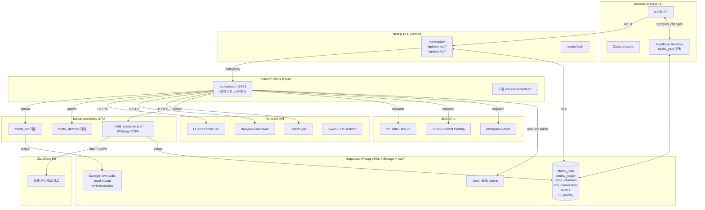
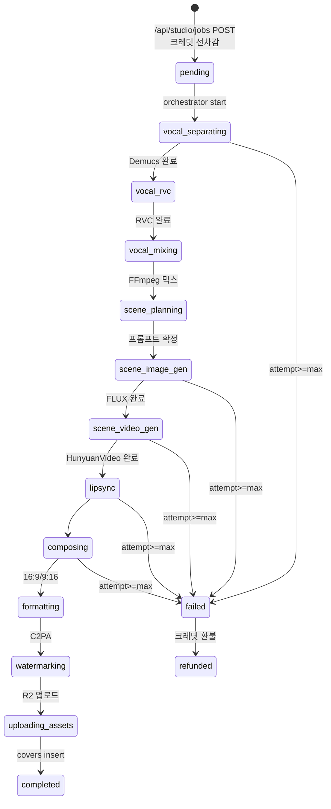

# 기술 청사진: Paradigm A — AI 커버 아티스트 공장 Phase 1

> **문서 버전**: 1.0 | **작성일**: 2026-04-18 | **작성자**: APEX (Architect)
> **기반 스펙**: `docs/specs/2026-04-18-paradigm-a-phase1.md`
> **전제**: Next.js 14 + FastAPI + Supabase 유지, Runware 전모델 + Modal GPU, 1인 운영, 커버 1편 ≤ $2.0

---

## 0. 설계 원칙

1. **기존 인프라 재사용 우선**: `modal_rvc.py`, `modal_demucs.py`, `lib/infra/backend-client.ts`, `vocal_user_plans`, 토스페이먼츠 confirm, Supabase RLS 패턴을 **대체하지 않고 확장**.
2. **외부 서비스 최대화**: Redis/BullMQ/Temporal/자체 GPU 클러스터 금지. 큐와 상태는 **Supabase Postgres 단일 소스**.
3. **상태머신은 DB 행이다**: `studio_jobs` 단일 테이블이 큐 + 상태머신 + 감사로그 동시 담당.
4. **GPU 지출 최적화**: Runware(이미지/비디오/TTS) + Modal(RVC/Demucs/FFmpeg). 새 GPU 프로바이더 추가 금지.
5. **실시간성은 Supabase Realtime**으로 통일. SSE/WebSocket 신규 도입 금지.

---

## 1. 기술 스택

| 레이어 | 선택 | 이유 |
|---|---|---|
| 프론트 | Next.js 14 App Router + TS strict | 기존 스택 |
| BFF | Next.js API Routes | 인증·RLS 프록시 |
| 도메인 백엔드 | FastAPI :8001 | `orchestrator` 라우터 추가 |
| GPU 워커 | Modal serverless | 기존 운영, `modal_video/lipsync/compose.py` 추가 |
| 이미지/비디오/TTS | Runware API | per-call pricing, Modal 직접 서빙 대비 30~50% 저렴 |
| 큐·상태관리 | Supabase Postgres + status 컬럼 + Realtime | 단일 소스 |
| 스토리지 | Supabase(중간) + **Cloudflare R2**(최종) | R2 egress 무료 |
| 워터마크 | c2pa-python (FFmpeg 후단) | 단일 지점 |
| 결제 | 토스페이먼츠(KRW) + Stripe(USD 구독) | 한·글로벌 분리 |
| OAuth (SNS) | 직접 구현 + Supabase Vault(pgsodium) | NextAuth 오버헤드 회피 |
| 상태관리 FE | Zustand + Supabase Realtime hook | 기존 패턴 |

---

## 2. 전체 시스템 아키텍처



---

## 3. 모듈별 책임

| 모듈 | 책임 | 금지 |
|---|---|---|
| Frontend | `/studio` 위저드, Zustand, Realtime 구독 | GPU 호출, 결제 서명 |
| BFF | requireAuth, RLS 프록시, 크레딧 선차감, orchestrator job create, 결제 confirm, Stripe 웹훅 | 파이프라인 실행 |
| FastAPI orchestrator | 상태머신 드라이브, Modal spawn, Runware 호출, 재시도, 환불 트리거 | 결제 승인 |
| Modal 함수 | 단일 단계 GPU 실행 + Supabase UPDATE | 다음 단계 판단 |
| Runware | 이미지/비디오/립싱크/TTS 단발 호출 | 상태관리 |
| Supabase | 큐, 상태머신, 원장, RLS, Realtime, 감사 | 순수 계산 |

**규칙**: 각 레이어는 인접 레이어 **하나씩만** 호출.

---

## 4. DB 스키마 (요약 — 전체 SQL은 `supabase/migrations/20260418_studio_pipeline.sql`)

```sql
-- 1) 크레딧 원장 (append-only)
CREATE TABLE studio_credits_ledger (
  id BIGSERIAL PRIMARY KEY,
  user_id UUID NOT NULL REFERENCES auth.users(id) ON DELETE CASCADE,
  delta INT NOT NULL,
  reason TEXT NOT NULL CHECK (reason IN (
    'signup_bonus','subscription_grant','topup_purchase',
    'cover_consume','scene_regen','boost',
    'job_refund','referral','admin_adjust')),
  job_id UUID,
  payment_id UUID,
  metadata JSONB NOT NULL DEFAULT '{}',
  created_at TIMESTAMPTZ NOT NULL DEFAULT now()
);
CREATE VIEW studio_credit_balances AS
  SELECT user_id, COALESCE(SUM(delta), 0)::INT AS balance
  FROM studio_credits_ledger GROUP BY user_id;

-- 원자적 소비 (pg_advisory_xact_lock)
CREATE OR REPLACE FUNCTION consume_credits(
  p_user_id UUID, p_amount INT, p_reason TEXT, p_job_id UUID DEFAULT NULL
) RETURNS BIGINT AS $$ ... $$ LANGUAGE plpgsql SECURITY DEFINER;

-- 2) 구독 확장
ALTER TABLE vocal_user_plans
  ADD COLUMN IF NOT EXISTS creator_tier TEXT CHECK (creator_tier IN ('starter','creator','pro')),
  ADD COLUMN IF NOT EXISTS billing_provider TEXT CHECK (billing_provider IN ('toss','stripe')),
  ADD COLUMN IF NOT EXISTS billing_key TEXT,
  ADD COLUMN IF NOT EXISTS monthly_credit_grant INT NOT NULL DEFAULT 0,
  ADD COLUMN IF NOT EXISTS next_renewal_at TIMESTAMPTZ;

-- 3) Voice Identity
CREATE TABLE voice_identities (
  id UUID PRIMARY KEY DEFAULT gen_random_uuid(),
  user_id UUID NOT NULL REFERENCES auth.users(id) ON DELETE CASCADE,
  status TEXT NOT NULL DEFAULT 'collecting'
    CHECK (status IN ('collecting','training','ready','failed','archived')),
  rvc_model_path TEXT,
  rvc_index_path TEXT,
  source_clip_count INT NOT NULL DEFAULT 0,
  total_duration_sec NUMERIC NOT NULL DEFAULT 0,
  mos_score NUMERIC,
  liveness_verified BOOL NOT NULL DEFAULT false,
  liveness_method TEXT,
  created_at TIMESTAMPTZ NOT NULL DEFAULT now(),
  ready_at TIMESTAMPTZ
);

-- 4) MR 카탈로그
CREATE TABLE mr_catalog (
  id UUID PRIMARY KEY DEFAULT gen_random_uuid(),
  title TEXT NOT NULL, artist TEXT NOT NULL,
  license_source TEXT NOT NULL, license_proof JSONB NOT NULL,
  sns_uploadable BOOL NOT NULL DEFAULT false,
  mr_storage_path TEXT NOT NULL,
  bpm NUMERIC, key_signature TEXT, genre TEXT,
  mood_tags TEXT[] NOT NULL DEFAULT '{}',
  duration_sec NUMERIC NOT NULL,
  created_at TIMESTAMPTZ NOT NULL DEFAULT now()
);

-- 5) Studio Jobs (큐 + 상태머신 + 감사)
CREATE TABLE studio_jobs (
  id UUID PRIMARY KEY DEFAULT gen_random_uuid(),
  user_id UUID NOT NULL REFERENCES auth.users(id) ON DELETE CASCADE,
  voice_identity_id UUID REFERENCES voice_identities(id),
  mr_catalog_id UUID REFERENCES mr_catalog(id),
  user_mr_path TEXT,
  raw_recording_path TEXT NOT NULL,
  style_preset TEXT NOT NULL CHECK (style_preset IN ('cinematic','cozy','neon_city','fantasy')),
  avatar_mode TEXT NOT NULL CHECK (avatar_mode IN ('user_photo','ai_realistic','ai_anime','faceless')),
  avatar_ref_path TEXT,
  status TEXT NOT NULL DEFAULT 'pending' CHECK (status IN (
    'pending','vocal_separating','vocal_rvc','vocal_mixing',
    'scene_planning','scene_image_gen','scene_video_gen',
    'lipsync','composing','formatting','watermarking',
    'uploading_assets','completed','failed','refunded')),
  progress_pct INT NOT NULL DEFAULT 0,
  current_step_label TEXT,
  cost_credits INT NOT NULL,
  ledger_entry_id BIGINT REFERENCES studio_credits_ledger(id),
  cost_usd_estimated NUMERIC,
  cost_usd_actual NUMERIC,
  attempt_count INT NOT NULL DEFAULT 0,
  max_attempts INT NOT NULL DEFAULT 3,
  last_error TEXT,
  failed_step TEXT,
  vocals_path TEXT, instrumental_path TEXT,
  converted_vocals_path TEXT, final_vocal_mix_path TEXT,
  scene_plan JSONB,
  landscape_url TEXT, portrait_url TEXT, thumbnail_url TEXT,
  title TEXT, description TEXT,
  c2pa_signed BOOL NOT NULL DEFAULT false,
  created_at TIMESTAMPTZ NOT NULL DEFAULT now(),
  started_at TIMESTAMPTZ, completed_at TIMESTAMPTZ,
  updated_at TIMESTAMPTZ NOT NULL DEFAULT now()
);
ALTER PUBLICATION supabase_realtime ADD TABLE studio_jobs;

-- 6) covers / 7) sns_connections / 8) publish_tasks / 9) publish_metrics / 10) revenue_share_ledger / 11) moderation_events
-- (전체 스키마는 마이그레이션 파일 참조)
```

**크레딧 원자성 설계**: append-only 원장 + 뷰 집계. `pg_advisory_xact_lock(hashtext('credits:'||user_id))`로 유저 단위 직렬화. Vercel 다중 인스턴스 안전.

---

## 5. API 엔드포인트

### Next.js BFF

| Method | 경로 | 역할 |
|---|---|---|
| POST | `/api/studio/jobs` | 크레딧 선차감 → job insert(pending) → orchestrator/start → 즉시 반환 |
| GET | `/api/studio/jobs/[id]` | 단일 조회 |
| POST | `/api/studio/jobs/[id]/retry` | 실패 job 재시작 |
| POST | `/api/studio/jobs/[id]/scene/regen` | 씬 단일 재생성 (1 크레딧) |
| POST | `/api/studio/voice-identity` | liveness + identities 생성 → modal_rvc train spawn |
| GET | `/api/mr-catalog` | 검색 필터 |
| GET/POST | `/api/credits/*` | balance/history/topup |
| POST | `/api/connect/[platform]/start` | OAuth 시작 |
| GET | `/api/connect/[platform]/callback` | 토큰 Vault 저장 |
| POST | `/api/publish` | publish_tasks 생성 → dispatch |
| POST | `/api/webhooks/toss`, `/api/webhooks/stripe` | 결제 이벤트 |
| GET | `/api/dashboard/creator/metrics` | 성과 집계 |

### FastAPI orchestrator (`X-Orchestrator-Secret` 헤더 필수)

| Method | 경로 | 역할 |
|---|---|---|
| POST | `/orchestrator/start` | 상태머신 시작 (BackgroundTasks) |
| POST | `/orchestrator/callback/modal` | Modal 완료 → 다음 단계 |
| POST | `/orchestrator/callback/runware` | Runware 완료 반영 |
| POST | `/orchestrator/publish/dispatch` | SNS 업로드 실행 |
| POST | `/orchestrator/voice/train` | RVC 학습 spawn |

### Modal 신규

- `modal_video.py::generate_scene_video` — Runware HunyuanVideo 어댑터 (CPU only, <30초)
- `modal_lipsync.py` — Runware LatentSync 어댑터
- `modal_compose.py::compose_final` — FFmpeg concat + 16:9/9:16 + C2PA + R2 업로드

---

## 6. MV 생성 상태머신



**재시도**: 단계별 3회, 씬 단위 재생성은 scene_image_gen/scene_video_gen만 재실행, compose 이후 실패 시 중간물 재사용하여 compose만 재실행.

**공정성**: user_id당 활성 job 3개 제한(Starter/Creator), Pro는 5개. 초과 시 60초 간격 지연.

---

## 7. 파일·폴더 구조 (신규)

```
vocalmind_2/vocalmind/
├── app/
│   ├── studio/
│   │   ├── page.tsx, StudioHomeClient.tsx
│   │   ├── new/{page.tsx, NewCoverWizardClient.tsx}
│   │   ├── [coverId]/{page.tsx, CoverDetailClient.tsx, publish/...}
│   │   ├── library/
│   │   └── voice-identity/{page.tsx, VoiceIdentityClient.tsx}
│   ├── dashboard/creator/{page.tsx, CreatorDashboardClient.tsx}
│   ├── connect/[platform]/page.tsx
│   ├── credits/{page.tsx, CreditsClient.tsx}
│   ├── mr-catalog/{page.tsx, MrCatalogClient.tsx}
│   └── api/
│       ├── studio/jobs/{route.ts, [id]/{route.ts, retry/route.ts, scene/regen/route.ts}}
│       ├── studio/voice-identity/route.ts
│       ├── mr-catalog/route.ts
│       ├── credits/{balance,history,topup}/route.ts
│       ├── connect/[platform]/{start,callback}/route.ts
│       ├── publish/route.ts
│       ├── webhooks/{toss,stripe}/route.ts
│       └── dashboard/creator/metrics/route.ts
├── backend/
│   ├── routers/orchestrator.py
│   ├── services/{studio_pipeline.py, runware_client.py, modal_dispatcher.py,
│   │            publish_dispatcher.py, scene_planner.py, moderation.py, c2pa_signer.py}
│   ├── schemas/{studio.py, publish.py}
│   ├── modal_video.py, modal_lipsync.py, modal_compose.py
├── components/
│   ├── studio/{MrPicker, RecordPane, StylePresetCards, AvatarModePicker,
│   │           JobProgressToast, ScenePreviewGrid, PublishChecklist, CreditBadge}.tsx
│   ├── creator-dashboard/{MetricsOverview, PlatformChart, TopCoversList}.tsx
│   └── shared/C2paBadge.tsx
├── lib/
│   ├── infra/{backend-client.ts(확장), runware.ts, r2-client.ts}
│   ├── services/{credits.ts, moderation-client.ts, sns-oauth.ts}
│   ├── hooks/{useStudioJob, usePublishTasks, useCredits}.ts
│   └── data/studioPresets.ts
├── stores/{studioStore, creatorDashboardStore, voiceIdentityStore}.ts
├── supabase/migrations/20260418_studio_pipeline.sql
└── docs/adr/{002~005}.md
```

**서버/클라이언트 경계**: `page.tsx`(서버, shell/초기 fetch/SEO) ↔ `XxxClient.tsx`(클라이언트, 인터랙션·Realtime).

**Zustand 스토어**:
| Store | Persist | 범위 |
|---|---|---|
| studioStore | O (style, avatarMode) | 위저드 세션 복구 |
| creatorDashboardStore | X | 탭/기간 필터 |
| voiceIdentityStore | O (clips 메타) | 녹음 진도 복구 |

---

## 8. 비용 모델 — 커버 1편 원가 (목표 ≤ $1.5)

3분 곡, 기본 4씬 × 15초 기준.

| 단계 | 서비스 | 비용 |
|---|---|---|
| Demucs 분리 | Modal T4 | $0.005 |
| RVC 변환 | Modal T4 | $0.007 |
| 씬 이미지 (4) | Runware FLUX Schnell | $0.012 |
| 씬 영상 (4 × 15s) | Runware HunyuanVideo | $1.40 |
| 립싱크 | Runware LatentSync | $0.15 |
| FFmpeg compose + 2포맷 | Modal CPU | $0.005 |
| C2PA 서명 | 로컬 | $0 |
| R2 저장 | Cloudflare | $0.001 |
| Claude 씬 프롬프트 | Haiku(캐시) | $0.0005 |
| **합계** | | **≈ $1.49** |

**전략**: 기본 4씬, Pro 티어만 6씬(+$0.70). Runware 대기 10분 초과 → fail+알림.

**Modal 원칙**: `scaledown_window=60`, `min_containers=0` → 유휴 비용 0.

---

## 9. 핵심 설계 결정 (ADR)

### D1 — 큐는 Supabase Postgres 단일 소스
BullMQ/Redis/Temporal 도입 금지. `studio_jobs.status` + `attempt_count`가 큐·상태머신·감사로그 겸직. Realtime으로 진행률 무료 방송. 월 5만 건 × 12 transition = 60만 UPDATE/월 → Postgres 충분.

### D2 — Runware vs Modal 역할 분담
- Runware: FLUX, HunyuanVideo, Wan, LatentSync (콜드스타트·스케일링 외주)
- Modal 기존: RVC(커스텀 모델 필요), Demucs
- Modal 신규: FFmpeg compose + C2PA (큰 로컬 I/O)
- FastAPI: scene_planner(Haiku), moderation, 상태머신 드라이브

### D3 — 크레딧 = Append-only 원장 + Advisory Lock
`pg_advisory_xact_lock(hashtext('credits:'||user_id))`로 동일 유저 직렬화. 뷰로 SUM 집계. `consume_credits()` SECURITY DEFINER RPC.

### D4 — 최종 MV는 Cloudflare R2
Supabase Storage는 egress 비쌈. R2 egress 무료 → 월 수천 USD 절감. 중간 산출물은 Supabase Storage + 48시간 자동 삭제(pg_cron).

### D5 — C2PA 단일 삽입 지점
`modal_compose.compose_final()` 내 R2 업로드 전 단일 서명. Modal Secret `vocalmind-c2pa-key` (ECDSA P-256). 서명 실패 = job failed.

### D6 — SNS OAuth 토큰 pgsodium 암호화
BFF는 평문 접근 금지. orchestrator만 복호화 RPC. 플랫폼 scope 최소화. 만료 10분 전 백그라운드 갱신.

### D7 — 실시간은 Supabase Realtime only
SSE/WebSocket 신규 도입 금지. `supabase.channel('studio_job_{id}').on('postgres_changes')` 구독. 오프라인 복귀 시 REST 동기화.

### D8 — 3단계 모더레이션 파이프
(1) 프롬프트 금지어 → (2) 씬 이미지 NSFW 분류 → (3) 최종 MV 얼굴 감지(미성년/유명인). 모두 `moderation_events`에 기록. 3회 차단 유저 → review 큐.

---

## 10. 보안·컴플라이언스 체크리스트

- [ ] 모든 신규 테이블 RLS + `auth.uid()=user_id`
- [ ] `consume_credits` SECURITY DEFINER + search_path 고정
- [ ] SNS 토큰 pgsodium, 로그 마스킹, 7일 순환
- [ ] API 키 `.env.local` 금지 (Vercel env + Modal Secret)
- [ ] 모든 MV C2PA 서명 강제
- [ ] Voice Identity liveness 검증 없이 학습 차단
- [ ] 유명인 유사도 80%+ 자동 차단
- [ ] 14세 미만 가입 차단
- [ ] 유저 MR 업로드 → `sns_uploadable=false` 강제
- [ ] CSP nonce, `Permissions-Policy: microphone=(self)` 유지
- [ ] Stripe/토스 웹훅 서명 검증
- [ ] R2 signed URL only (퍼블릭 금지)
- [ ] DMCA 48시간 SLA
- [ ] `requireAuth()` 100% (body.userId 금지)
- [ ] Anthropic `cache_control: ephemeral` 유지

---

## 11. 마일스톤 매핑

### M1 (1개월) — MVP 파이프라인
- W1: 마이그레이션 + `studio_jobs` 상태머신 + `modal_compose` + 크레딧 테스트
- W2: F1 코어 (Demucs→RVC→FLUX→HunyuanVideo→compose 일직선) + `/studio/new` + Realtime
- W3: F2 voice-identity + 프리셋 2종 + F5 토스 크레딧 충전
- W4: 내부 알파 50명, 튜닝, 환불 검증

### M2 (2개월) — 공개 런칭
- W5: F4 립싱크+아바타, 프리셋 4종
- W6: F6 SNS OAuth(YouTube→TikTok→Instagram) + publish dispatcher
- W7: F7 대시보드 + MR 30곡 + Stripe 구독
- W8: 랜딩/요금제 교체, 런칭, 인플루언서 시딩

### M3 (3개월) — 스케일
- W9-10: F8 수료→데뷔 트리거, F9 MR 100곡, F10 리텐션
- W11: 비용 최적화
- W12: 광고 수익 분배 정산, Phase 2 준비

---

## 12. Generator 규칙 (TDD·코드 표준)

1. **TDD 강제**: 테스트 먼저 → 실패 → 구현 → PASS
2. **파일 네이밍**: 기존 규칙 (PascalCase 컴포넌트, useXxx 훅, modal_* Python)
3. **낙관적 잠금**: `UPDATE studio_jobs SET status=? WHERE id=? AND status=?`
4. **에러 응답**: `{error, code}` 통일
5. **Supabase 클라이언트**: BFF = 유저 인증 클라이언트(RLS), FastAPI = service role
6. **Modal 함수**: `modal_rvc.py` SupabaseClient 패턴 재사용 + `timeout≤600` + `scaledown_window=60` + Secrets
7. **Runware 호출**: `runware_client.py` 단일 경유 (직접 httpx 금지)
8. **비용 로깅**: 모든 GPU/API 호출 후 `cost_usd_actual` 누적
9. **200줄+ 분리**: `pipeline/{vocal,scene,compose}.py`
10. **Anti-pattern**: `as any`, `bare except`, `librosa.load`, `datetime.now()` without UTC 금지
11. **새 라우트** = 네비 링크 + 테스트 동시 작성
12. **ADR 동시 작성**: D1~D8 → `docs/adr/002~005.md`

---

## 13. 데이터 흐름 요약

```
유저 → /api/studio/jobs → 크레딧 차감 → studio_jobs(pending) → orchestrator/start
  → vocal_separating(Demucs) → vocal_rvc(RVC) → vocal_mixing(FFmpeg)
  → scene_planning(Claude) → scene_image_gen(FLUX×N) → scene_video_gen(HunyuanVideo×N)
  → lipsync(LatentSync) → composing(FFmpeg) → formatting(16:9+9:16) → watermarking(C2PA)
  → uploading_assets(R2) → completed → covers insert
  → /publish → publish_tasks×플랫폼 → publish_dispatcher → SNS API → 24h cron metrics
```

---

**설계 완료. 다음: `/awesome-design`(UI 리서치·DESIGN.md 생성) → generator → evaluator.**
